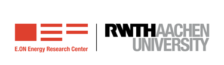
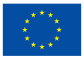

# Twin4DER

A model-based Digital Twin for for power systems containing Distributed Energy Resources

# Description

In Twin4DER we focus on the development of Digital Twins (DTs) for power systems containing Distributed Energy Resources (DER) and interfacing them with applications that produce forecasting using AI models. The goal is to run power system simulations in combination with them and evaluate system level scenarios.

The underlying power system models of the DTs are based on real world networks from the pilots within the project.

The simulations are performed with the open-source real-time simulator [DPsim](https://github.com/sogno-platform/dpsim).

# License

The project is released under the terms of the MPL 2.0, as can be seen in the [LICENSE file](./LICENSE).

There are Docker images included, and as it is normal in this type of situations, the software there contained may have other licenses. It is responsibility of the user of the image to comply with the relevant licenses of the software contained within.

# Contact

- Leonardo Carreras <leonardo.carreras@eonerc.rwth-aachen.de>
- Institute ACS <post-acs@eonerc.rwth-aachen.de>

# Copyright

2023 - [Institute for Automation of Complex Power Systems, EONERC, RWTH Aachen University](https://www.acs.eonerc.rwth-aachen.de)

Contact us for other licensing options writing to Prof. Antonello Monti <post-acs@eonerc.rwth-aachen.de>

# Acknowledgements

This software was developed by the Institute for Automation of Complex Power Systems, EONERC, RWTH Aachen University as part of the [I-NERGY project](https://i-nergy.eu/).

 

The I-NERGY Project has received funding from the European Union's Horizon 2020 Research and Innovation programme under grant agreement No. 101016508

The content of this page is for information purposes only. The relevant legal instruments and the text of the call shall take precedence over the information contained in this page. The European Commission or EASME does not accept responsibility for any use made of the information contained therein.